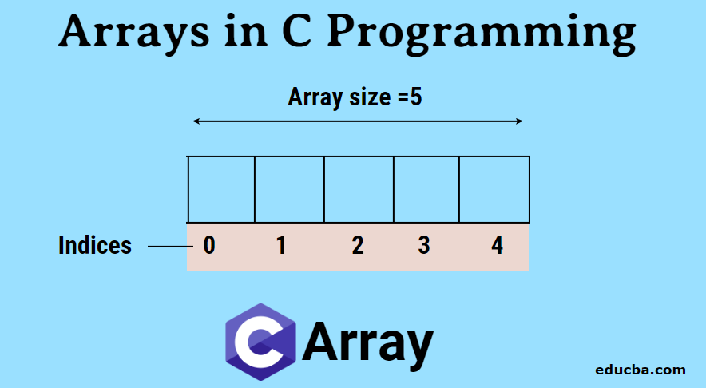

# C Programming Arrays

 (https://cdn.educba.com/academy/wp-content/uploads/2019/10/Arrays-in-C-Programming-2.png)

As part of the Data Structures and Algorithms course I took in my second year, first semester of college, I was given this as an assignment. These code files implement arrays in various ways. What each program does is the first commented line in each code file.